# 대한민국의 지역별 인구밀도 및 남녀 인구 수 차이에 대한 visualization

***
* 전국 인구밀도(using json)  
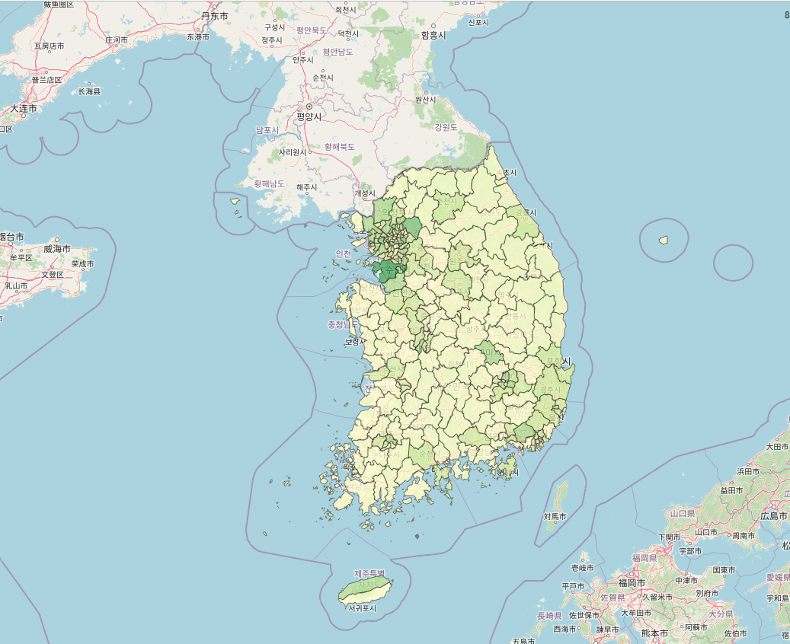</img> 
위의 사진을 보면 수도권이 인구밀도가 높은 것을 알 수 있다.  
***
파이썬 코드를 실행시키면 위의 인구 밀도 지도가 있는 html 창이 뜨고 console창에는 아래와 같이 뜬다.  
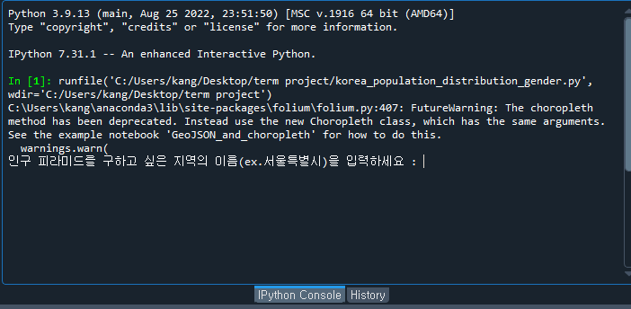</img> 
이곳에 전국/서울특별시/제주특별자치도/전국팔도/광역시를 입력할 수 있고 입력하면 plot이 등장한다.  
***
* 전국 인구 피라미드  
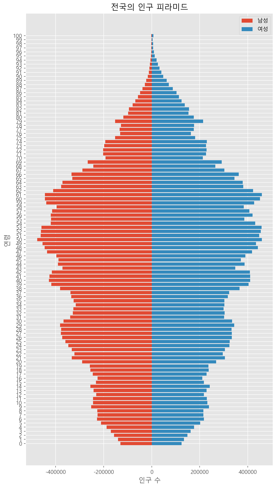</img> 
전국 인구 피라미드를 보았을 때 남녀 성비가 대부분 비슷해 보인다.      
* 전국 인구 산점도  
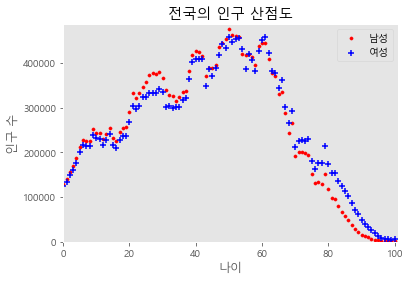</img> 
산점도를 보았을 때 남녀 성비가 약간씩 차이가 나는 게 약간씩 보인다.  
나이가 많을수록 여성 인구 수가 남성 인구 수보다 많고 나이가 적을수록 인구 수가 적음을 알 수 있다.
이를 추세선을 추가하여 보자.      
* 전국 남녀 인구 수 차이 추세선  
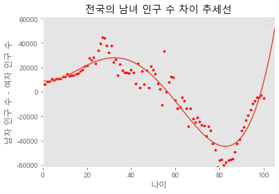</img> 
추세선을 보았을 때 차이를 한눈에 보기가 쉽다. 전국 기준으로 60세 이상은 여성 인구가, 60세 미만으로는 남성 인구가 많은 것을 알 수 있다. 
그렇다면 다른 지역은 어떠할까? 지역 간 나이에 따른 성비 차이가 있을까?
      

* 광주광역시  
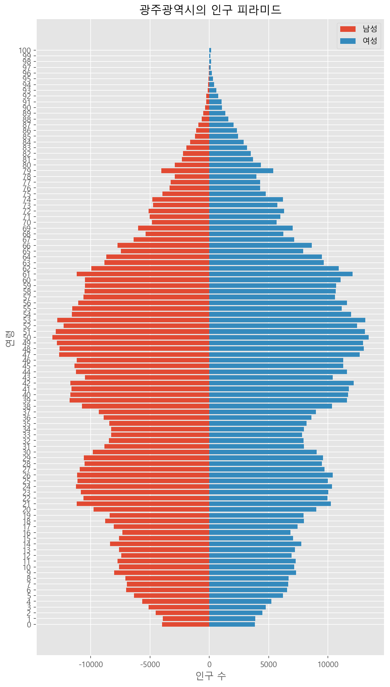</img> 
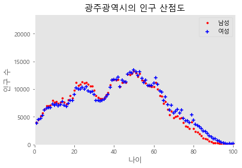</img> 
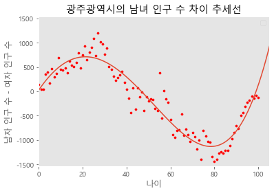</img> 
광주는 전국과 비슷한 형태라고 볼 수 있다. 
그렇다면 가장 인구밀도가 높은 수도권, 그중에서도 가장 높은 서울특별시는 어떠할까?      

* 서울특별시  
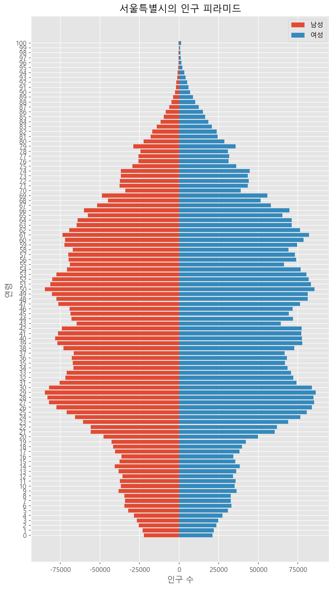</img> 
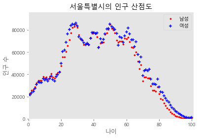</img> 
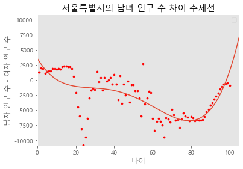</img> 
서울은 전국, 광주와는 다르게 20대,40대,50대,60대 이후 모두 여성이 남성보다 많다.
***
  
통계청에서 광역시,특별시처럼 큰 지역 단위로 이루어진 통계자료 말고 공릉동 같이 작은 지역 단위로 이루어진 통계자료도 얻을 수 있다.  
이를 이용하면 우리 주변 지역의 남녀 성비를 알 수 있을 것이다.
